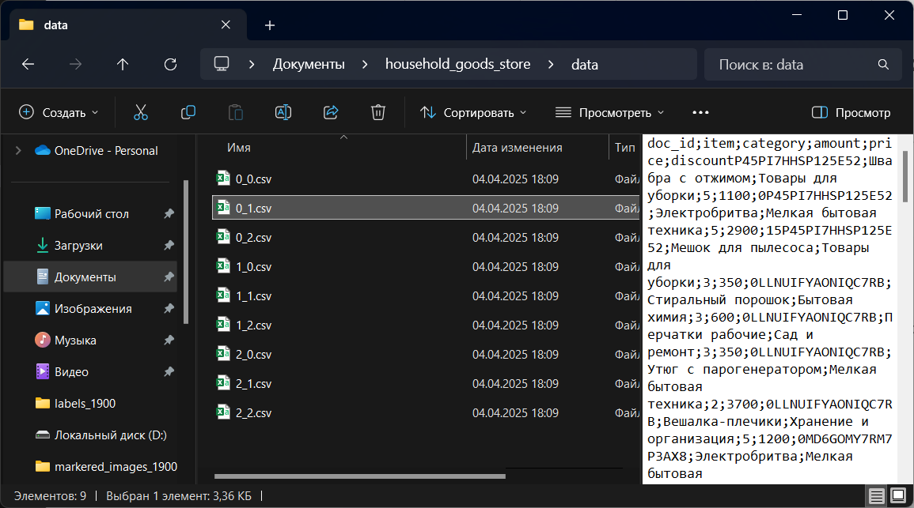
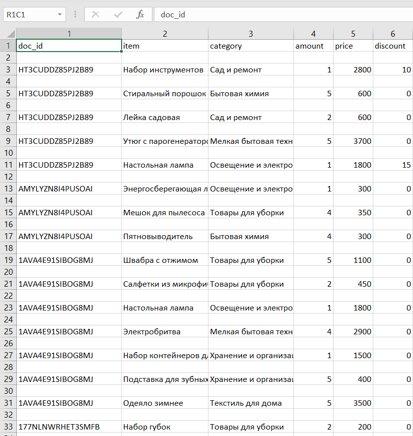
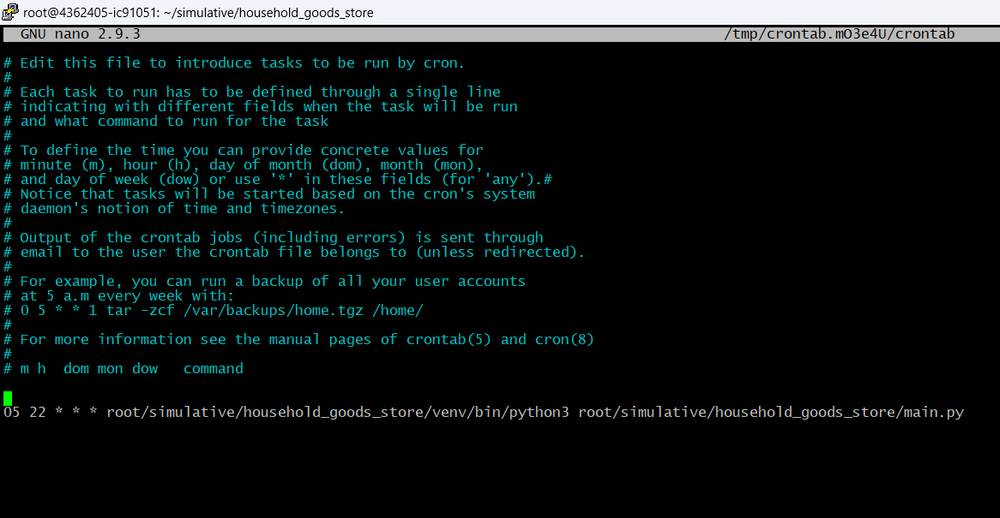

## Программа для генерации выгрузок с магазина бытовых товаров

---

Для клонирования репозитория и запуска программы введите команды.

```
git clone https://github.com/Quainter2510/household_goods_store.git
pip install -r requirements.txt
python main.py
```

### Принцип работы программы

Программа генерирует чеки с кассовых аппаратов за день и загружает их в csv файл. Количество магазинов и кассовых аппаратов устанавливается в файле config.ini. В файле products.json находится список товаров с ценами в магазинах, разбитых по категориям.

### пример директории data после запуска программы



### пример файла с выгрузкой



### Программа запускается на сервере каждый день в 22:05 с помощью утилиты cron


